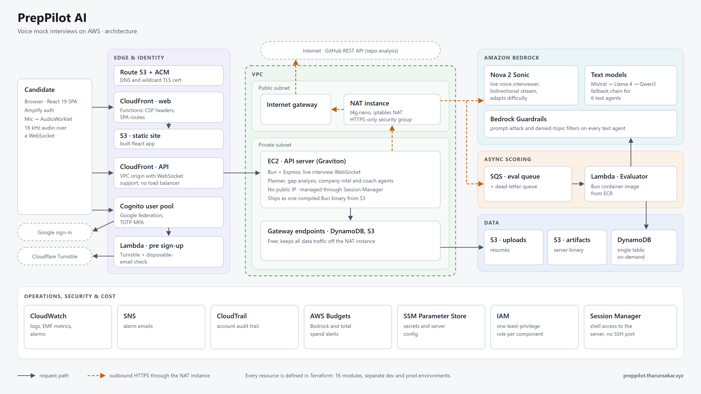

# PrepPilot AI

> ⚠️ **Work in progress.** The product is built end to end, but the backend has not been deployed yet. Expect breaking changes.

PrepPilot AI is a voice-based mock interview platform built on AWS. A candidate saves their resume and GitHub username once. After that, they can run live spoken interviews generated from that material. Each answer is scored in the background, and a Coach agent turns the results into an improvement plan.

Personal details are removed from the resume before any model sees it. The original PDF is stored in S3, and the Planner only reads the redacted text. See [ADR-0007](my-turborepo/docs/adr/0007-user-scoped-redacted-candidate-material.md).

## Architecture



- **Edge:** CloudFront serves the React app from S3. A second distribution sits in front of the API, using a VPC origin with WebSocket support and no load balancer.
- **API:** a single Bun + Express server on a private Graviton EC2 instance with no public IP, managed through SSM Session Manager.
- **Outbound traffic:** a NAT instance handles Bedrock, SQS, Cognito and GitHub calls. DynamoDB and S3 traffic goes through free gateway endpoints.
- **AI:** Amazon Nova 2 Sonic runs the live speech-to-speech interview. The text agents run on Ministral 3 8B, falling back to Llama 4 Scout and then Qwen3, all behind Bedrock Guardrails.
- **Async scoring:** answers are sent to an SQS queue (with a dead-letter queue), and a container-image Lambda Evaluator scores them.
- **Data:** a single on-demand DynamoDB table, plus S3 for resumes and build artifacts.
- **Auth:** a Cognito user pool with Google sign-in and TOTP MFA. A pre-sign-up Lambda checks Cloudflare Turnstile and rejects disposable email addresses.

Every resource is defined in Terraform. The design reasoning is in [`docs/architecture/Overview.md`](my-turborepo/docs/architecture/Overview.md), and the decisions are recorded in [`docs/adr/`](my-turborepo/docs/adr/).

## Agents

| Agent              | Runs                                       | Produces                                               |
| ------------------ | ------------------------------------------ | ------------------------------------------------------ |
| Planner            | once per session                           | focus areas, question mix, difficulty, length          |
| Gap                | once per session, if a job posting is given | each requirement rated strong / weak / none           |
| Company Intel      | once per session, if a company is named    | interview style, focus, seniority bar                  |
| Mock Interview     | the live Nova 2 Sonic stream               | the interview itself                                   |
| Evaluator          | once per answer                            | correctness / clarity / depth, plus a rewrite of weak answers |
| Session Summarizer | once per completed session                 | what the whole round showed, per category              |
| Coach              | on request                                 | trends per topic and a two-track study roadmap         |

## Tech stack

- **Monorepo:** Turborepo + Bun workspaces
- **Frontend:** `apps/web`, a Bun-native React 19 app (not Vite or Next.js) using Tailwind v4 and shadcn/ui
- **Backend:** `apps/servers`, Express 5 + TypeScript. All AWS SDK calls live here.
- **Shared:** `packages/shared`, Zod schemas that define every API and stored data shape (`@repo/shared`)
- **AI:** Amazon Bedrock only (no OpenAI, Ollama or other external LLM APIs)
- **Auth:** Amazon Cognito · **Secrets:** SSM Parameter Store · **Infra:** Terraform
- **Tests:** `bun test` (not Jest), with `aws-sdk-client-mock`, happy-dom and React Testing Library

## Project structure

```
my-turborepo/
├── apps/
│   ├── servers/          # Express API, agents, interview WebSocket, eval worker
│   └── web/              # React 19 frontend
├── packages/
│   ├── shared/           # Zod schemas & inferred types
│   ├── ui/
│   ├── eslint-config/
│   └── typescript-config/
├── infra/terraform/
│   ├── modules/          # vpc, compute, api_edge, cloudfront, cognito, dynamodb,
│   │                     # s3, sqs, evaluator, guardrail, iam, ssm, cloudwatch,
│   │                     # alerts, budgets, cloudtrail
│   └── environments/     # global, dev, prod (separate state each)
└── docs/
    ├── architecture/     # overview, API, data model, diagram
    └── adr/              # architecture decision records
```

## Getting started

Run these from `my-turborepo/`:

```bash
bun install
bun run dev           # servers on :8000, web on :3000
```

```bash
bun run build         # build all apps/packages
bun run check-types   # typecheck all workspaces  (CI runs this)
bun run test          # bun test across workspaces (CI runs this)
bun run format        # prettier --write (also formats markdown)
```

The project uses Bun only. Don't use npm, yarn or pnpm. CI ([`.github/workflows/ci.yml`](.github/workflows/ci.yml)) runs `check-types` and `test` on every PR and on every push to `dev` and `master`.

## Branches

- **`dev`**: all feature work happens here.
- **`master`**: the deploy branch. It only receives merges from `dev`, so every merge is a release.

## Conventions and contributing

The coding standards and project rules are in **[`my-turborepo/claude.md`](my-turborepo/claude.md)**. Read it before making changes. It covers:

- which architecture doc or ADR to read for each kind of change
- TypeScript rules: strict mode, no `any`, no `!`, and Zod as the source of truth
- no hardcoded values: config, copy and constants each live in their own module
- the two separate Bedrock paths (Converse for text agents, a bidirectional stream for Sonic)
- the decisions that are locked and the features that are deferred
- the cost rules, because Bedrock and Sonic streams bill for as long as they are open

Related documents:

- [`my-turborepo/infra/terraform/CLAUDE.md`](my-turborepo/infra/terraform/CLAUDE.md): Terraform conventions. Read this before editing any `.tf` file.
- [`my-turborepo/CLAUDE.local.md`](my-turborepo/CLAUDE.local.md): a phase-by-phase build log and the list of open items
