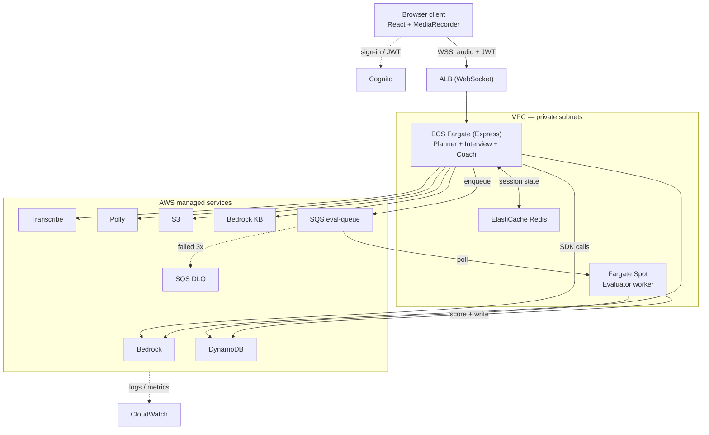

# PrepPilot AI — Architecture

> **Scope**: v1 of PrepPilot AI is focused exclusively on **Mock Interview Mode**. Concept Mastery Mode (quizzes, flashcards, adaptive study plans, Topic and Quiz agents) is deferred to a later phase. This document reflects the narrowed scope.

---

## 1. What PrepPilot AI does

A candidate uploads their resume and provides a GitHub username. PrepPilot ingests both, plans an interview mix suited to the candidate's background, then runs a live spoken interview in the browser: the candidate speaks, Amazon Transcribe converts audio to text, an LLM on Bedrock generates the next question or follow-up, and Amazon Polly reads it back through the browser. After the round, an Evaluator scores each answer asynchronously and a Coach agent produces an improvement plan grounded in a Bedrock Knowledge Base.

The full v1 candidate journey is: authenticate → upload resume + GitHub → receive a planned interview → conduct a spoken interview → receive scores and a personalised improvement plan.

---

## 2. Architecture

The corresponding Excalidraw diagram is maintained alongside this document. In prose, the request path looks like this:

The browser client authenticates directly with Amazon Cognito to obtain a JWT. It then opens a WebSocket connection to an Application Load Balancer, passing the JWT in the handshake. The ALB routes the connection to an ECS Fargate service running Express, which validates the JWT locally against Cognito's public JWKS — Cognito never sits in the per-request data path.

Inside the same VPC, the Express service reads and writes live session state to ElastiCache Redis (current question, turn count, rate-limit counters) and calls out to AWS-managed services through a single scoped IAM task role: Amazon Bedrock for LLM inference, Amazon Transcribe for streaming speech-to-text, Amazon Polly for text-to-speech, DynamoDB for durable session data, S3 for resumes and audio, and Bedrock Knowledge Base for RAG.

When an interview round ends, Express enqueues each answer to an SQS queue for asynchronous scoring. A second ECS Fargate service — running on Spot capacity — consumes the queue, calls Bedrock to score each answer, and writes results to DynamoDB. Messages that fail three times land in a dead-letter queue. Once all evaluations complete, the Coach agent (running in the main Express service) queries the Bedrock Knowledge Base for relevant learning material and produces the improvement plan.

CloudWatch collects logs and metrics from both ECS services and from managed-service invocations.

### 2.1 Mermaid rendering (for GitHub)



---

## 3. Agents (four, not six)

With Concept Mastery deferred, the Quiz and Topic agents are out of scope for v1. The remaining four agents:

**Planner Agent** reads resume text (parsed with `unpdf`) and GitHub scrape data (`@octokit/rest`), and produces an interview plan: mix of behavioural vs technical questions, target difficulty, and focus areas drawn from the candidate's repositories and stated skills. Runs once at session start.

**Mock Interview Agent** runs the live interview loop. It orchestrates the turn cycle — Transcribe (STT) → Bedrock (question generation and follow-ups) → Polly (TTS) — maintains state in Redis, and persists the running transcript to DynamoDB.

**Evaluator Agent** runs asynchronously on the Fargate Spot worker. It scores each answer on correctness, clarity, and depth (0–10 each) and writes structured feedback to DynamoDB. Consumed from the SQS `eval-queue`; failures beyond `maxReceiveCount: 3` land in the DLQ.

**Coach Agent** runs after all evaluations complete. It uses Bedrock Knowledge Base to retrieve relevant learning material and produces a personalised improvement plan grounded in the candidate's specific weak areas.

In v1 all four are plain TypeScript functions with stable signatures — no LangGraph, no LangChain, no separate agent processes. Signature stability is deliberate: v2 can swap function bodies for LangGraph nodes without touching the callers.

---

## 4. Design decisions

### Cognito outside the data path

JWTs are minted once at sign-in by Cognito directly to the client (via Amplify). Express validates them locally against Cognito's public JWKS endpoint, cached in memory. Cognito is not a per-request dependency, which cuts latency and removes one failure mode from the interview loop.

### ALB, not API Gateway

The interview loop requires bidirectional WebSocket transport. ALB terminates WebSocket natively as an HTTP-family listener rule. API Gateway would require a separate WebSocket API plus a VPC Link to reach the same Fargate service — extra hops, extra cost, no gain.

### WebSocket, not WebRTC

WebRTC's value is peer-to-peer NAT traversal and codec negotiation for browser-to-browser media. Neither applies here — audio flows browser → your own backend, and Transcribe streaming expects an HTTP/2 event stream, not SRTP over UDP. WebSocket over TCP gives ordered, complete delivery, which is what STT needs (a dropped audio chunk corrupts a transcript).

### Redis for hot state, DynamoDB for durable state

Redis holds ephemeral, high-frequency data that changes every turn (current question index, turn count) and rate-limit counters (`INCR` + `EXPIRE`). None of it needs to outlive the session. DynamoDB holds the permanent record: session metadata, Q&A transcript, and evaluation scores. Two stores, two different lifetimes. Cognito is not used for session state — it is not built for that write frequency and its attribute size limits do not fit the data shape.

### SQS + Fargate Spot for async evaluation

Post-round scoring does not need to block the interview loop. SQS decouples the two: Express hands off answers to the queue and returns immediately; the worker consumes at its own pace. Running the worker on Fargate Spot cuts compute cost by around 70%, and SQS's visibility-timeout mechanism makes Spot reclamation safe — an interrupted task's message becomes visible again for another consumer.

The dominant cost driver here is Bedrock inference tokens, not the worker's compute, so Spot savings are on a smaller line item. Still worthwhile: it demonstrates a resilient, cost-aware batch-processing pattern and gives the evaluator its own IAM role scoped to `bedrock:InvokeModel` and DynamoDB write on the `EVAL#` items only.

Idempotency: SQS is at-least-once delivery, so evaluations are keyed by `questionId` and written with `PutItem` — a redelivered message overwrites the same item rather than double-counting.

---

## 5. Data model

### DynamoDB single-table design

```
PK                   SK                Item type
SESSION#<sid>        META              session metadata, plan
SESSION#<sid>        ANSWER#<qId>      question + candidate transcript
SESSION#<sid>        EVAL#<qId>        per-answer scores
SESSION#<sid>        EVAL#SUMMARY      overall rollup + completion counter
SESSION#<sid>        COACH             improvement plan
USER#<uid>           SESSION#<sid>     lookup by user (GSI on SK)
```

A single `Query` on `PK = SESSION#<sid>` returns the entire session state. A GSI on `SK` supports the user history lookup.

### Redis key layout

```
session:<sid>:state       JSON blob of live interview state, TTL = 2h
ratelimit:<uid>:<minute>  INCR counter, 60s TTL
lock:session:<sid>        SET NX for single-consumer locks (if needed)
```

Nothing in Redis needs backup; every key is either rebuildable from DynamoDB or safe to discard.

### S3 layout

```
resumes/<uid>/<sid>.pdf         input resume
audio/<sid>/<qId>.webm          interview audio recordings
frontend/                        static assets served via CloudFront
```

All uploads use presigned URLs — the browser writes directly to S3 without proxying through Express.

---

## 6. Interview session lifecycle

**Pre-session.** The client uploads the resume to S3 via a presigned URL and provides a GitHub username. Express parses the PDF with `unpdf`, scrapes GitHub via `@octokit/rest`, and the Planner agent runs the two ingestions in parallel with `Promise.all`, then writes the plan to DynamoDB under `SESSION#<sid> / META`.

**Live interview.** The client opens the WebSocket to the ALB with the JWT. Express opens a Transcribe streaming session for that WS. Each turn: the client streams audio chunks over WSS; Express relays them into Transcribe; on receiving a transcript, Express calls Bedrock's `ConverseCommand` for the next question or follow-up, calls Polly for the audio, streams audio back to the client, writes the Q&A pair to DynamoDB, and updates state in Redis.

**Post-session.** Express enqueues each answer to the SQS `eval-queue` and closes the WebSocket. The Evaluator workers consume messages independently, scoring each with Bedrock and writing to DynamoDB. A completion counter (`UpdateItem` with `ADD completedCount 1`) tracks progress; when it hits the total question count, the worker publishes to a small `coach-trigger` topic (or invokes the Coach agent directly). The Coach pulls relevant learning material from the Bedrock Knowledge Base and produces the improvement plan. The client polls (or reconnects to receive a push) for the final result.

---

## 7. Infrastructure (Terraform)

All AWS resources are provisioned via Terraform with remote state in S3. File layout:

```
infra/terraform/modules
├── main.tf          provider, backend, common variables
├── vpc.tf           VPC, subnets (public + private), NAT, security groups
├── cognito.tf       user pool, app client
├── s3.tf            resume + audio bucket, frontend bucket
├── cloudfront.tf    CDN in front of frontend bucket
├── dynamodb.tf      single table + GSI
├── elasticache.tf   Redis cluster, subnet group
├── compute.tf       ECS cluster, main service, evaluator service (Spot)
├── sqs.tf           evaluation queue, DLQ, redrive policy
├── bedrock.tf       Knowledge Base + data source
├── ssm.tf           parameter store entries for runtime config
├── iam.tf           two task roles + least-privilege policies
└── cloudwatch.tf    log groups, alarms
```

Two IAM task roles, not one:

- **Main API role**: `bedrock:InvokeModel` / `Converse`, `transcribe:StartStreamTranscription`, `polly:SynthesizeSpeech`, DynamoDB read/write on session items, S3 read/write on scoped prefixes (`resumes/*`, `audio/*`), `sqs:SendMessage` on the eval queue ARN only, network access to Redis via SG.
- **Evaluator worker role**: `bedrock:InvokeModel` / `Converse`, DynamoDB write on `EVAL#*` items only, `sqs:ReceiveMessage` / `DeleteMessage` on the eval queue ARN only.

Never share a role between the two services — least privilege between boundaries is the whole point of splitting them.

---

## 8. Decisions locked in for v1

- AWS-only for all AI inference (no OpenAI, no Ollama, no external LLM APIs)
- No Python anywhere
- No LangGraph, LangChain, or agent framework — plain TypeScript functions
- Terraform provisions every AWS resource; no manual console operations
- Bun as package manager and runtime across the monorepo
- Cognito for auth; no third-party providers (Clerk, Auth0, etc.)
- Secrets via SSM Parameter Store; no `.env` files in production
- shadcn/ui for components; no Material UI, no Ant Design
- Mock Interview Mode is the only user-facing feature in v1

---

## 9. Deferred to later phases

- Concept Mastery Mode (Topic agent, Quiz agent, adaptive study plans, flashcards)
- LangGraph migration for agent orchestration
- Bedrock AgentCore evaluation
- LiveKit / WebRTC transport
- Multi-tenancy, teams, payments, real-time collaborative features

---

## 10. Build cadence

Currently in Weeks 1–2 (Foundation). The narrowed weekly plan:

- **Weeks 1–2** — monorepo scaffold, shared Zod schemas in `packages/shared`, Planner agent skeleton
- **Weeks 3–4** — resume parsing (`unpdf`), GitHub scraping, Cognito auth, DynamoDB single-table schema
- **Weeks 5–6** — WebSocket transport, Amazon Transcribe streaming integration, Mock Interview agent turn loop
- **Week 7** — Bedrock integration end-to-end (`ConverseCommand`), Polly TTS wired into the client
- **Week 8** — Evaluator agent, SQS + DLQ wiring, Fargate Spot worker deployment
- **Week 9** — Coach agent, Bedrock Knowledge Base setup, RAG grounding
- **Weeks 10–12** — Terraform for ECS deploy, GitHub Actions CI/CD, CloudWatch alarms, load testing

---

## 11. Key references

- Repo: `Tharun2331/Mock_Interview_Platform`
- Bedrock models: `meta.llama3-1-8b-instruct-v1:0` (primary), `meta.llama3-2-3b-instruct-v1:0` (backup), `mistral.mistral-7b-instruct-v0:2` (fallback)
- Bedrock SDK: `@aws-sdk/client-bedrock-runtime` — prefer `ConverseCommand`, fall back to `InvokeModelCommand` where a model does not support it


## 12. Coding Standards — PrepPilot AI

## TypeScript
- `strict: true` always on (see `tsconfig.base.json`). Never weaken it.
- No `any`. Use `unknown` + a type guard, or a generic.
- No non-null assertions (`!`). Handle the null/undefined case explicitly.
- No type assertions (`as`) except right after a runtime check that proves the narrowing.
- Use Zod schemas in `packages/shared` as the single source of truth; infer types with `z.infer<>` rather than hand-writing duplicate interfaces.
- Prefer `type` for unions/utility types, `interface` for extendable object shapes.

## No hardcoded values
- No magic strings/numbers in logic — put them in a `constants.ts` or `const enum`.
- No hardcoded user-facing text inline — put in a `messages.ts` (even without i18n yet).
- No hardcoded config (URLs, table names, Bedrock model IDs) — pull from the typed config module backed by SSM Parameter Store. Never read `process.env.X` directly outside that module.

## Structure & reuse
- Small, single-purpose functions over large ones. Agents in v1 are plain TypeScript functions — no LangGraph.
- Shared types/schemas live only in `packages/shared`, never duplicated across `apps/web` and `apps/server`.
- Path aliases (`@shared/*`) instead of relative `../../../` imports.
- Pure functions where possible, for easy Jest unit testing.

## Errors & async
- Typed custom error classes (e.g. `class BedrockError extends Error`), never `throw "string"`.
- Every async Express route wrapped in try/catch or an error-handling middleware — no unhandled rejections.
- Use a typed `{ ok, data }` / result-style return for predictable failures instead of throwing.

## Enforcement (already wired, don't bypass)
- ESLint flat config (`eslint.config.js`) with `@typescript-eslint/no-explicit-any`, `no-non-null-assertion`, `no-floating-promises` set to `error`.
- Prettier (`.prettierrc.json`) for formatting — don't hand-format.
- Husky + lint-staged blocks commits that fail lint/format.

## Project constraints (do not suggest otherwise)
- All AI runs through AWS Bedrock — no OpenAI, no Ollama, no external LLM APIs.
- No Python in v1 — agents are TypeScript functions in the Express server.
- No LangGraph/LangChain until v2.
- Terraform manages all AWS resources — no manual console changes.
- Bun as package manager across the monorepo.
- Auth is Cognito only. Secrets in SSM only — no `.env` in production.
- shadcn/ui only for components.