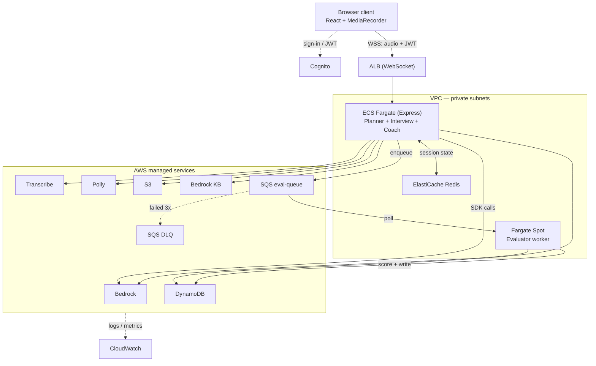

# PrepPilot AI — Architecture

> **Scope**: v1 is focused exclusively on **Mock Interview Mode**. Concept
> Mastery Mode (quizzes, flashcards, adaptive study plans, Topic and Quiz
> agents) is deferred to a later phase. This document reflects the narrowed
> scope.

**Status:** target architecture · Last verified against `main`: 2026-08-11

Branches: `dev` for feature work, `main` for deployment. Everything below marked
"on `dev`" has not yet reached `main`, and so is not visible to tooling that
reads the default branch.

Sections 2 onward describe the system as designed, not as built. Section 1
records what actually exists. Where the two differ, section 1 wins.

---

## 1. Current state

**On `main`:**

- Turborepo + Bun workspace: `apps/servers`, `apps/web`, `packages/ui`,
  `packages/eslint-config`, `packages/typescript-config`
- Express 5 on port 8000 with one route: `POST /api/v1/pre-interview`
- GitHub repo scraping via `axios` through a DataImpulse HTTP proxy
- Bun-native React 19 web with three screens: Form, Interview, Result
- Zod 4 validation on the one existing route

**Not built:**

- Any AWS integration. No `@aws-sdk/*` package is in the lockfile. Bedrock,
  Transcribe, Polly, DynamoDB, Cognito, S3, SQS — none are wired.
- `infra/terraform/` — **on `dev`, not yet merged to `main`**. Contains
  `modules/{cloudfront,cognito,iam,s3,ssm,vpc}` and
  `environments/{global,dev,prod}`. No module yet for DynamoDB, ElastiCache,
  SQS, ALB, ECS, Bedrock KB, or CloudWatch.
- `packages/shared` — not a workspace; the servers uses a local `types.ts`
- `@octokit/rest`, `unpdf`, Jest, Husky, lint-staged
- All four agent functions
- Resume upload and PDF parsing

**Naming conflict to resolve:** the pushed repo uses `apps/servers` /
`apps/web`; the local working tree uses `apps/servers` / `apps/web`. Pick
one before writing cross-package imports or Terraform task definitions.

---

## 2. What PrepPilot AI does

A candidate uploads their resume and provides a GitHub username. PrepPilot
ingests both, plans an interview mix suited to the candidate's background, then
runs a live spoken interview in the browser: the candidate speaks, Amazon
Transcribe converts audio to text, an LLM on Bedrock generates the next
question or follow-up, and Amazon Polly reads it back through the browser.
After the round, an Evaluator scores each answer asynchronously and a Coach
agent produces an improvement plan grounded in a Bedrock Knowledge Base.

The v1 candidate journey: authenticate → upload resume + GitHub → receive a
planned interview → conduct a spoken interview → receive scores and a
personalised improvement plan.

---

## 3. Architecture

The browser client authenticates directly with Amazon Cognito to obtain a JWT.
It then opens a WebSocket connection to an Application Load Balancer, passing
the JWT in the handshake. The ALB routes the connection to an ECS Fargate
service running Express, which validates the JWT locally against Cognito's
public JWKS — Cognito never sits in the per-request data path.

Inside the same VPC, the Express service reads and writes live session state to
ElastiCache Redis (current question, turn count, rate-limit counters) and calls
out to AWS-managed services through a single scoped IAM task role: Bedrock for
inference, Transcribe for streaming speech-to-text, Polly for text-to-speech,
DynamoDB for durable session data, S3 for resumes and audio, and Bedrock
Knowledge Base for RAG.

When an interview round ends, Express enqueues each answer to an SQS queue for
asynchronous scoring. A second ECS Fargate service — running on Spot capacity —
consumes the queue, calls Bedrock to score each answer, and writes results to
DynamoDB. Messages that fail three times land in a dead-letter queue. Once all
evaluations complete, the Coach agent (in the main Express service) queries the
Bedrock Knowledge Base for relevant learning material and produces the
improvement plan.

CloudWatch collects logs and metrics from both ECS services and from
managed-service invocations.



---

## 4. Agents (four, not six)

With Concept Mastery deferred, the Quiz and Topic agents are out of v1 scope.

**Planner Agent** reads resume text (parsed with `unpdf`) and GitHub scrape
data, and produces an interview plan: mix of behavioural vs technical
questions, target difficulty, and focus areas drawn from the candidate's
repositories and stated skills. Runs once at session start.

**Mock Interview Agent** runs the live interview loop. It orchestrates the turn
cycle — Transcribe → Bedrock → Polly — maintains state in Redis, and persists
the running transcript to DynamoDB.

**Evaluator Agent** runs asynchronously on the Fargate Spot worker. It scores
each answer on correctness, clarity, and depth (0–10 each) and writes
structured feedback to DynamoDB. Consumed from the SQS `eval-queue`; failures
beyond `maxReceiveCount: 3` land in the DLQ.

**Coach Agent** runs after all evaluations complete. It uses Bedrock Knowledge
Base to retrieve relevant learning material and produces a personalised
improvement plan grounded in the candidate's specific weak areas.

All four are plain TypeScript functions with stable signatures — no LangGraph,
no LangChain, no separate agent processes. Signature stability is deliberate:
v2 can swap function bodies for LangGraph nodes without touching callers.

> The GitHub ingestion path is currently `axios` + DataImpulse proxy, not
> `@octokit/rest`. Decide which one the Planner depends on before building it —
> they have different rate-limit and auth characteristics.

---

## 5. Design decisions

Each of these has a corresponding record in [`../adr/`](../adr/) with the
rejected alternatives spelled out. Summarised here:

**Cognito outside the data path.** JWTs are minted once at sign-in by Cognito
directly to the client via Amplify. Express validates them locally against
Cognito's public JWKS endpoint, cached in memory. Cognito is not a per-request
dependency, which cuts latency and removes a failure mode from the interview
loop.

**ALB, not API Gateway.** See [ADR-0002](../adr/0002-alb-not-api-gateway.md).

**WebSocket, not WebRTC — and not HTTP.** See
[ADR-0001](../adr/0001-websocket-transport-for-transcribe.md).

**Redis for hot state, DynamoDB for durable state.** See
[ADR-0003](../adr/0003-redis-hot-state-dynamodb-durable.md).

**SQS + Fargate Spot for async evaluation.** See
[ADR-0004](../adr/0004-sqs-fargate-spot-async-evaluation.md).

---

## 6. Data model

### DynamoDB single-table design

```
PK                   SK                Item type
SESSION#<sid>        META              session metadata, plan
SESSION#<sid>        ANSWER#<qId>      question + candidate transcript
SESSION#<sid>        EVAL#<qId>        per-answer scores
SESSION#<sid>        EVAL#SUMMARY      overall rollup + completion counter
SESSION#<sid>        COACH             improvement plan
USER#<uid>           SESSION#<sid>     lookup by user (GSI on SK)
```

A single `Query` on `PK = SESSION#<sid>` returns the entire session state.
User history is a Query on the `USER#<uid>` partition.

Full item shapes, access patterns, and consistency rules are in
[`data-model.md`](./data-model.md). It supersedes this summary — note in
particular that the GSI once planned here turns out to be unnecessary.

### Redis key layout

```
session:<sid>:state       JSON blob of live interview state, TTL = 2h
ratelimit:<uid>:<minute>  INCR counter, 60s TTL
lock:session:<sid>        SET NX for single-consumer locks (if needed)
```

Nothing in Redis needs backup; every key is either rebuildable from DynamoDB or
safe to discard.

### S3 layout

```
resumes/<uid>/<sid>.pdf         input resume
audio/<sid>/<qId>.webm          interview audio recordings
web/                       static assets served via CloudFront
```

Uploads use presigned URLs — the browser writes directly to S3 without
proxying through Express.

---

## 7. Interview session lifecycle

**Pre-session.** The client uploads the resume to S3 via a presigned URL and
provides a GitHub username. Express parses the PDF with `unpdf`, scrapes
GitHub, and the Planner agent runs the two ingestions in parallel with
`Promise.all`, then writes the plan to DynamoDB under `SESSION#<sid> / META`.

**Live interview.** The client opens the WebSocket to the ALB with the JWT.
Express opens a Transcribe streaming session for that connection. Each turn:
the client streams audio chunks over WSS; Express relays them into Transcribe;
on receiving a transcript, Express calls Bedrock's `ConverseCommand` for the
next question, calls Polly for the audio, streams audio back to the client,
writes the Q&A pair to DynamoDB, and updates state in Redis.

**Post-session.** Express enqueues each answer to the SQS `eval-queue` and
closes the WebSocket. Evaluator workers consume messages independently, scoring
each with Bedrock and writing to DynamoDB. A completion counter (`UpdateItem`
with `ADD completedCount 1`) tracks progress; when it reaches the total
question count, the worker triggers the Coach agent. The Coach pulls relevant
learning material from the Knowledge Base and produces the improvement plan.
The client polls or reconnects for the final result.

### Latency budget

Target is roughly 1.6–2.0 seconds from the candidate finishing a sentence to
hearing the next question. That budget constrains design choices: Bedrock
responses are streamed, Polly synthesis starts on the first complete sentence
rather than waiting for the full generation, and system prompts stay short —
long prompts cost both input tokens and time-to-first-token.

---

## 8. Infrastructure (Terraform)

**Modules plus per-environment roots.** Reusable modules under `modules/`;
each directory under `environments/` is a separate root module with its own
state file and servers config. Terraform runs from inside an environment
directory, never from `infra/terraform` or from a module.

```
infra/terraform/
├── environments/
│   ├── global/         us-east-1 pinned + cross-environment shared
│   ├── dev/
│   └── prod/
└── modules/
    ├── vpc/            VPC, subnets (public + private), NAT, security groups
    ├── cognito/        user pool, app client, custom domain
    ├── s3/             resume + audio bucket, web bucket
    ├── cloudfront/     CDN in front of web bucket
    ├── iam/            task roles + least-privilege policies
    ├── ssm/            parameter store entries for runtime config
    ├── dynamodb/       single table + GSI                      (not built)
    ├── elasticache/    Redis cluster, subnet group             (not built)
    ├── alb/            listener rules, WebSocket target group  (not built)
    ├── ecs/            cluster, API service, Spot worker       (not built)
    ├── sqs/            eval queue, DLQ, redrive policy         (not built)
    ├── bedrock/        Knowledge Base + data source            (not built)
    └── cloudwatch/     log groups, alarms                      (not built)
```

`global` holds what can't live in an environment: ACM certificates consumed by
CloudFront (region-pinned to `us-east-1`), the Route 53 hosted zone for
`tharunsekar.xyz`, and the state bucket and lock table themselves. Changes
there affect both `dev` and `prod`.

Detailed conventions — module structure, provider placement, output wiring,
secret handling, apply gating — are in
[`../../infra/terraform/CLAUDE.md`](../../infra/terraform/CLAUDE.md).

### Ordering dependency: Cognito custom domain

`auth.tharunsekar.xyz` cannot be created until AWS resolves an A record at the
**apex** of `tharunsekar.xyz`; without one the apply fails with
`InvalidParameterException`. The unblock is a placeholder CloudFront + S3
distribution at the apex, applied from `global` before the Cognito module runs.
This is a real ordering constraint between roots, not a transient error.

### IAM

Two ECS task roles, never shared:

**Main API role** — `bedrock:InvokeModel` / `Converse`,
`transcribe:StartStreamTranscription`, `polly:SynthesizeSpeech`, DynamoDB
read/write on session items, S3 read/write on scoped prefixes (`resumes/*`,
`audio/*`), `sqs:SendMessage` on the eval queue ARN only, network access to
Redis via security group.

**Evaluator worker role** — `bedrock:InvokeModel` / `Converse`, DynamoDB write
on `EVAL#*` items only, `sqs:ReceiveMessage` / `DeleteMessage` on the eval
queue ARN only.

Least privilege between service boundaries is the entire reason for splitting
them. Sharing a role collapses the benefit.

---

## 9. Model selection

| Role     | Model                              | Notes                                             |
| -------- | ---------------------------------- | ------------------------------------------------- |
| Primary  | `meta.llama3-1-8b-instruct-v1:0`   | Latency/quality balance for interview turns        |
| Backup   | `meta.llama3-2-3b-instruct-v1:0`   | Faster, lower quality — fall back under load       |
| Fallback | `mistral.mistral-7b-instruct-v0:2` | Different provider; hedges regional capacity issues |

All accessed through `ConverseCommand`, which gives one message format across
providers. Falling back between them is a config change, not a code change.

---

## 10. Cost model

**Always-on, regardless of usage:** NAT Gateway (~$32/month per AZ plus data
processing) and ElastiCache. During scaffold weeks with no ECS tasks running,
the NAT Gateway is pure waste — destroy and recreate it between sessions.

**Per-use:** Bedrock input and output tokens, Transcribe audio minutes, Polly
characters. A single 20-minute interview is small; the real risk is a runaway
loop or unbounded retry hammering Bedrock. Rate limiting in Redis is a cost
control, not just an abuse control.

At expected portfolio volumes the self-built stack lands around $8–9/month
excluding NAT — materially cheaper than managed voice-agent alternatives with
subscription floors.

---

## 11. Build cadence

Currently in Weeks 1–2 (Foundation).

- **Weeks 1–2** — monorepo scaffold, shared Zod schemas, Planner agent skeleton
- **Weeks 3–4** — resume parsing, GitHub scraping, Cognito auth, DynamoDB schema
- **Weeks 5–6** — WebSocket transport, Transcribe streaming, turn loop
- **Week 7** — Bedrock end-to-end (`ConverseCommand`), Polly wired to client
- **Week 8** — Evaluator agent, SQS + DLQ, Fargate Spot worker
- **Week 9** — Coach agent, Knowledge Base setup, RAG grounding
- **Weeks 10–12** — Terraform ECS deploy, GitHub Actions CI/CD, alarms, load testing

Weeks 5–7 together are the interview loop and should be built as one unit —
they're only meaningful end to end.

---

## 12. Deferred

Concept Mastery Mode (Topic agent, Quiz agent, adaptive study plans,
flashcards) · LangGraph migration · Bedrock AgentCore evaluation · LiveKit /
WebRTC transport · multi-tenancy, teams, payments, real-time collaboration.

---

## 13. References

- Repo: `Tharun2331/Mock_Interview_Platform`
- Coding standards and hard constraints: [`../../CLAUDE.md`](../../CLAUDE.md)
- Decision records: [`../adr/`](../adr/)
- Bedrock SDK: `@aws-sdk/client-bedrock-runtime` — prefer `ConverseCommand`,
  fall back to `InvokeModelCommand` where a model doesn't support it